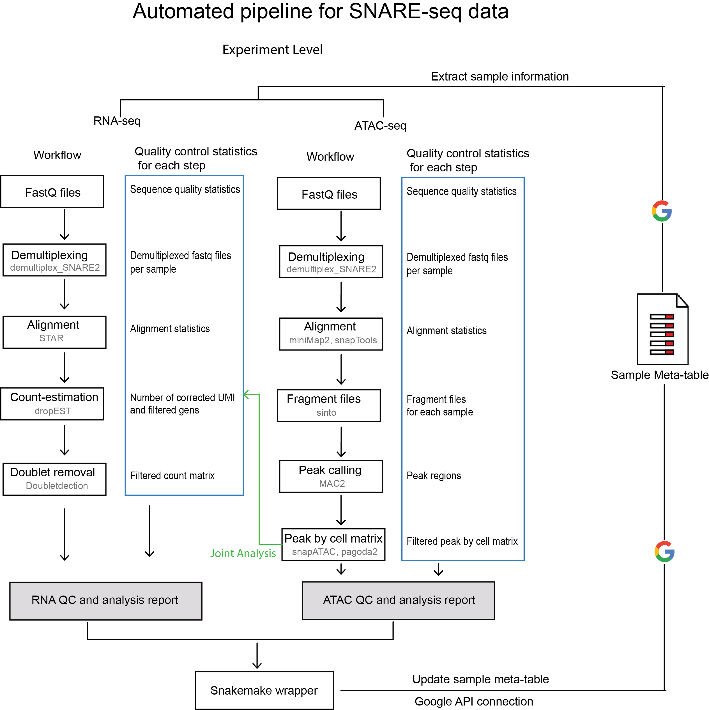

snarePip
===============================
## Overview
snarePip is an analysis pipeline designed for [snare-seq]( https://www.nature.com/articles/s41587-019-0290-0) data. It can also be used for joint processing and analyze single-cell RNA and atac sequencing dataset. 
It contains 2 independent part: data processing/analysis and meta-table manipulation.
The data processing part is based on [Snakemake](https://snakemake.readthedocs.io) framework, which provides an automated framework for complex analysis including quality assessment, doublet removal, cell clustering and identification, peak generation, differential accessible region identification and linkage analysis. 
The meta-table part is designed for easier meta-table manipulation and migration including automated extraction of sample information, preparation of data uploading and update of QC statics generated by the pipeline. 
The current version of pipeline automatically processing single-cell RNA and ATAC datasets with flexible analysis modules and generate summary reports for both quality assessment and downstream analysis.


The entire framework is based on DAG and [luigi](https://luigi.readthedocs.io/en/stable/) framework is used to build the DAG that connect data processing and meta-table part together with salted workflow for better version control.


## Installation
Installation contains 2 parts, for meta-table and python related functions:
```bash
pip install pipenv
pipenv install -e https://github.com/huqiwen0313/snarePip.git#egg=master
```

snarePip R package for atac-seq QC and downstream analysis
```bash
install.packages("devtools")
devtools::install_github("huqiwen0313/snarePip")
```  

