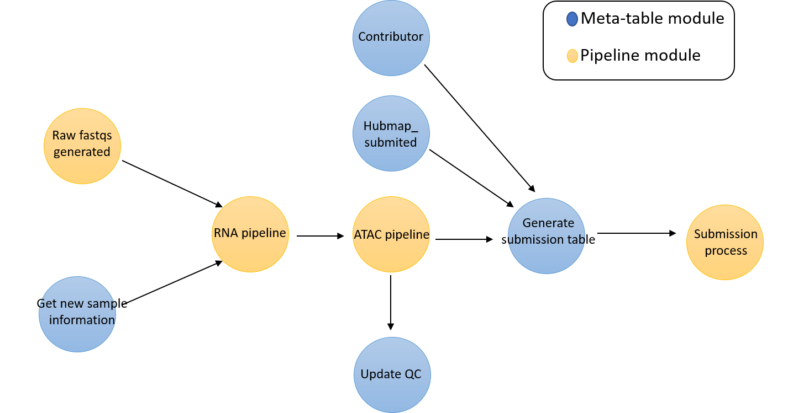
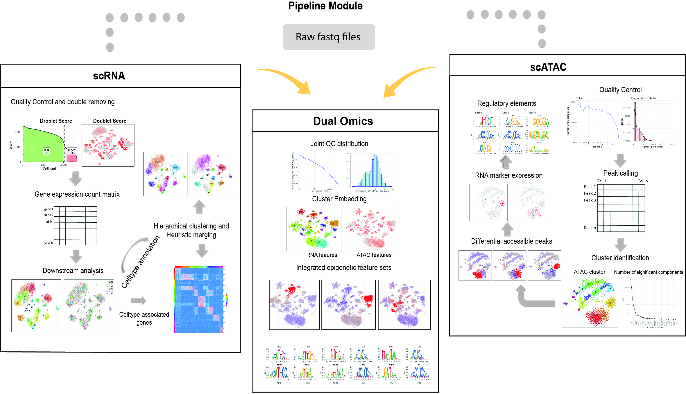

snarePip
===============================
[](https://travis-ci.com/github/huqiwen0313/snarePip)

## Overview
snarePip is an analysis pipeline designed for [snare-seq]( https://www.nature.com/articles/s41587-019-0290-0) data. 
It can also be used for joint processing and analyze single-cell RNA and atac sequencing dataset. 

It contains 2 independent modules: data processing and meta-table manipulation.
The data processing part is based on [Snakemake](https://snakemake.readthedocs.io) framework, which provides an automated framework for complex analysis including quality assessment, doublet removal, cell clustering and identification, peak generation, differential accessible region identification and linkage analysis. 

The meta-table part is designed for easier meta-table manipulation and migration including automated extraction of sample information, preparation of data uploading and update of QC statics generated by the pipeline. 
The current version of pipeline automatically processes single-cell RNA and ATAC datasets with flexible analysis modules and generates summary reports for both quality assessment and downstream analysis.

The entire framework is based on Directed acyclic graph (DAG) and [luigi](https://luigi.readthedocs.io/en/stable/) framework is used to build the DAG that connect data processing and meta-table part together with salted workflow for better version control.

<p align="center"> 

</p>

**DAG of Snare-seq automated processing system**

## Installation
#### Requirements
* [dropestr](https://github.com/kharchenkolab/dropestr)
* [SnapATAC](https://github.com/r3fang/SnapATAC)

Installation contains 2 parts, for meta-table and python related functions:
```bash
git clone https://github.com/huqiwen0313/snarePip.git
cd snarePip
pip install .
```

snarePip R package for atac-seq QC and downstream analysis
```bash
if (!requireNamespace("BiocManager", quietly = TRUE))
    install.packages("BiocManager")
BiocManager::install(c("Rsamtools", "edgeR", "DropletUtils", "ATACseqQC", "pcaMethods", "TFBSTools",
                        "JASPAR2018", "motifmatchr", "BSgenome.Hsapiens.NCBI.GRCh38", "ComplexHeatmap"))

install.packages("devtools")
devtools::install_github("huqiwen0313/snarePip", ref="main")
```  

## Usage
For running the pipeline with default steps:
```bash
git clone https://github.com/huqiwen0313/snarePip.git
cd snarePip
python -m snarePip [arguments]
```
Arguments | Description
-----------|----------
`-s or --sampletable` | Name of google sheet contains sample information.
`-w or --worksheet` | which worksheet to load from google spreadsheet, default 0(the first worksheet).
`-r or --RNAdir` | path to RNA folder that processed results will be saved.
`-a or --ATACdir` | path to ATAC folder that processed results will be saved.
`-c or --cores` | number of cores used to run snakemake pipeline.
`-sr or --snakeRNA` | snakemake file for RNA processing.
`-sa or --snakeATAC` | snakemake file for ATAC processing.
`-t or --type` | assay type, e.g. snare_2, tenX.
`-sb or --subtable` | name of hubmap_submission table.
`-sc or --ctable` | name of Contributor table.

For uploading task:
```bash
python -m snarePip [arguments] --upload
```
Arguments | Description
-----------|----------
`-r or --RNAdir` | path to RNA folder that processed results will be saved.
`-a or --ATACdir` | path to ATAC folder that processed results will be saved.
`-sb or --subtable` | name of hubmap_submission table.
`-sm or --submeta` | name of hubmap_submission_metatable.


## Pipeline Module
<p align="center"> 

</p>

## Meta-table structure
There are several tables that record different information we need:
1)	sample table (links): record Experiment_ID, sample_ID and the other information. The ‘flag’ column in the sample table shows if the sample has been processed or not. 
2)	QC tables (current have 4 tables: experiment-level_RNA, sample-level_RNA, experiment-level_ATAC, sample-level_ATAC): record the QC statistics when processing pipeline is finished
3)	Contributor: table contains information of person that contributor to individual sample
4)	Hubmap_submission: table contains submission information. The raw experiment data will be submitted to public server once the processing pipeline is finished and submission path is existed in the hubmap_submission table
5)	Hubmap_submission_metatable: the table describes the details for each experiment that need to be submitted to public server along with the raw experiment datasets.
The format of hubmap_metatable is consistent with [hubmap guidelines](https://github.com/hubmapconsortium/ingest-validation-tools).

The relationship among different tables is shown below:
<p align="center"> 

</p>

To enable automated meta-table connection, please set up [google API](https://www.dundas.com/support/learning/documentation/connect-to-data/how-to/connecting-to-google-sheets) and add JSONKEY_PATH="your_crential" into .env file in the snarePip main folder.


## Reference
https://doi.org/10.1101/2021.07.28.454201

The package can be cited as:

```
Qiwen Hu, Xin Wang, Dihn Diep, Blue Lake, Kun Zhang and Peter Kharchenko (2021). SnarePip. Package version 0.1.0.
```

